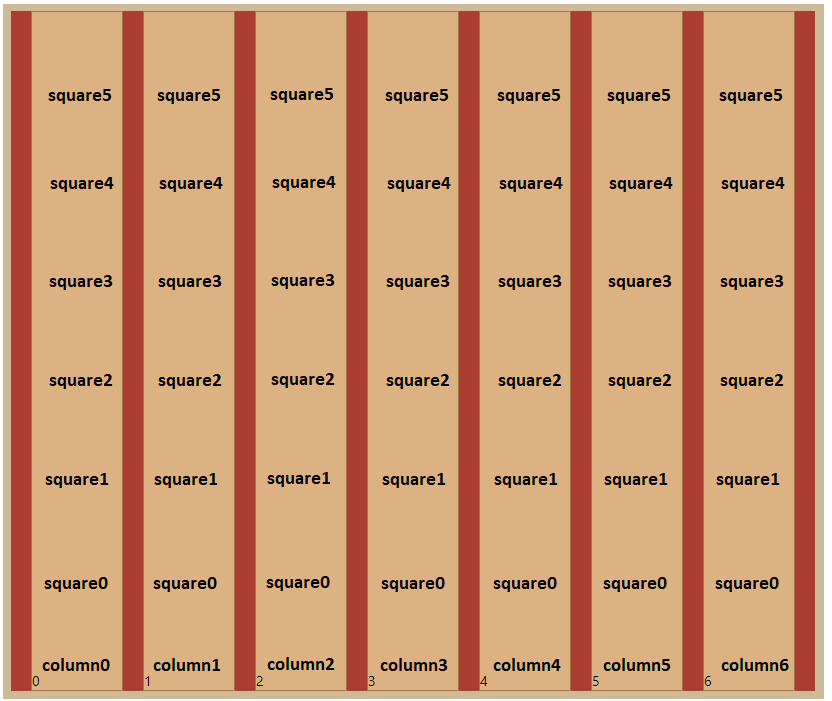
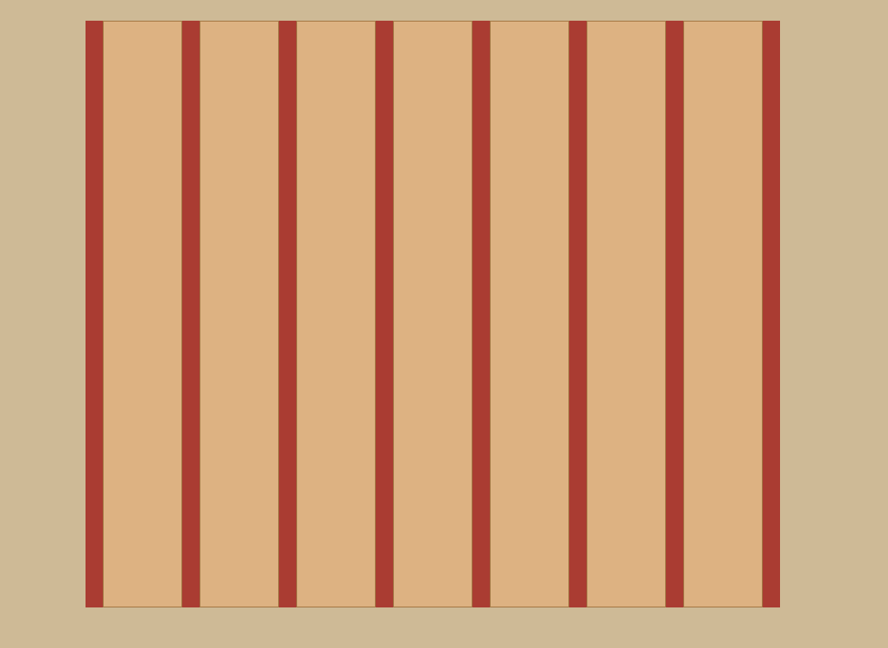

# 4In-a-row-BOILERPLATE
Our TEMPLATE for starting the 4 In A Row Challenge

## Game instructions:
The goal of the game is to draw either a vertical, horizontal or diagonal line with four balls of the same player chained together.
Two players take turns in threading their balls into one of the seven columns. 
Each ball is placed in the lowest possible position in the selected column.
The game immediately ends when one player connects four balls or when there is no empty space on the board - a tie.
 

## Requirements:
- The game board should be consisted of 7 columns (array of columns), with each of them having an id: column0, column1, column2...
- Each of the columns should be consisted of 6 squares (array of squares), with each of them having a className of 'Square' and an id: square0, square1, square2.. 
- When a column is clicked. the lowest empty square should have a div with a className: player1, player2
according to the turn. (player1 goes first)
- Game result (victory/tie) should be represented in a modal, that is labeled with the className: winModal.
- Win can be Horizontal, Vertical, Diagonal up, Diagonal down.

## Tests:
player1 goes first !!

## for debug run in a new terminal - cd client; $env:DEBUG='true'; npm run test
- Board is initially empty when the game starts
- if you fill up a collumn with balls it won't exceed the 6 ball limit, and will not change the turn of the player.
- Every time you click a column, it will add a div with the CORRECT className (player1 or player2) to the CORRECT square.
- The game can end with a tie (all squares are full)
- Player can win the game by having 4 balls in a row
- Player can win the game by having 4 balls in a column
- Player can win the game by having 4 balls in an ascending diagonal line
- Player can win the game by having 4 balls in a descending diagonal line

## expected Id Layout:

* 'column(number)' represents the id of the whole element surrounding the six squares
* 'square(number) represents the id of each div inside the column container.
* throughout the game each square will be filled with a child labeled by the className 'player1' or 'player2'.
## Win demonstrations:

